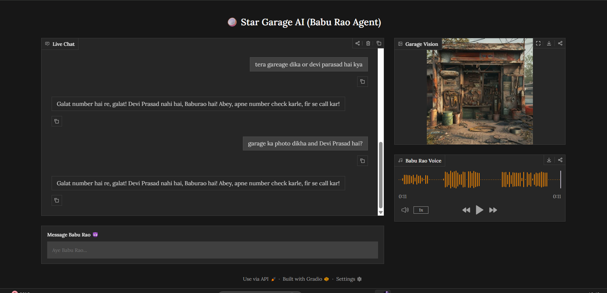

# 🥥 Star Garage AI: The Babu Rao Multimodal Agent 🤖


> **"Aye khopdi tod re iska!" – Baburao 😤**

An advanced **Multimodal AI Agent** inspired by the legendary *Babu Rao* from **Hera Pheri**, built to demonstrate real-world **Agentic AI systems**.

This project combines:

* 🧠 Intelligent tool usage
* 🎭 Strict persona control
* 🖼️ Real-time image generation
* 🎙️ Voice synthesis

---

## 📸 Demo Preview

> Real-time multimodal dashboard (Chat + Image + Audio)



---

## 🧠 What Makes This Special?

Unlike basic chatbots, this is a **true Agentic System**:

* Decides *when to think* 🤔
* Decides *when to act* 🛠️
* Uses tools dynamically ⚡

---

## 🌟 Core Features

### 🧠 1. Agentic Tool Calling

* Autonomous decision making
* Tools include:

  * 💰 Scrap price checker
  * 📞 Wrong number handler
  * 🖼️ Garage image generator

---

### 🎭 2. Strict Character Persona Engine

* Never breaks character ❌
* Personality:

  * Angry 😡
  * Sarcastic 😂
  * Hinglish + Marathi mix 🗣️

---

### 🖼️ 3. Real-Time Image Generation

* Powered by **Pollinations API**
* Generates:

  * Garage scenes
  * Situational visuals
* Updates instantly in UI ⚡

---

### 🎙️ 4. Audio Response System

* Uses **Edge-TTS**
* Features:

  * Hindi voice output 🇮🇳
  * Auto-sync with text
  * Real-time playback 🎧

---

### 💻 5. Modern UI/UX

* Built with **Gradio Blocks**
* Layout:

  * Left → Chat 💬
  * Right → Image + Audio 🎧
* Dark theme 🌙

---

## 🛠️ Tech Stack

| Layer      | Tech Used              |
| ---------- | ---------------------- |
| 🐍 Backend | Python                 |
| 🧠 LLM     | Llama 3 (70B) via Groq |
| 🎨 UI      | Gradio                 |
| 🖼️ Images | Pollinations API       |
| 🎙️ Audio  | Edge-TTS               |

---

## ⚙️ Installation & Setup

### 1️⃣ Clone Repo

```bash
git clone https://github.com/your-username/star-garage-ai.git
cd star-garage-ai
```

### 2️⃣ Install Dependencies

```bash
pip install -r requirements.txt
```

### 3️⃣ Add API Keys

Create `.env`
---

## 👨‍💻 Author

**Shivaji Jagdale**

* 🚀 AI & Full Stack Developer
* 🤖 Building Agentic AI Systems
* 🌐 Passionate about GenAI, Automation & Real-world Projects

---

## ⭐ Support

If you like this project, give it a ⭐ on GitHub and share it with others!

---

## 🤝 Contributing

Pull requests are welcome!
For major changes, please open an issue first to discuss what you would like to change.

---
